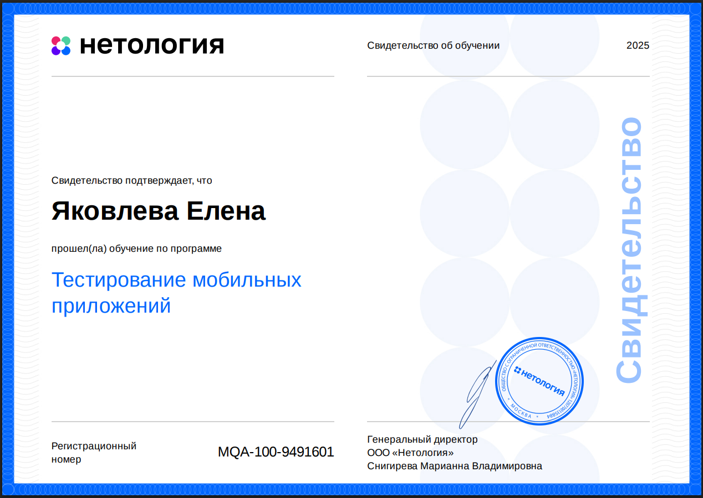

# Домашние задания по курсу «Тестирование мобильных приложений»

## Блок «Мануальное тестирование мобильных приложений»

1.1. [Ручное тестирование мобильных приложений. Введение.](https://github.com/Elena-Yakovleva/MobApp/blob/main/lection1/lection1.md)

- [Условия задач](https://github.com/Elena-Yakovleva/MobApp/blob/main/lection1/README.md)
  - [Ссылки]()
    - [software-testing](https://www.software-testing.ru/images/stories/library/checklist-mobile-app-testen.pdf)
    - [habr.com](https://habr.com/ru/companies/mobileup/articles/336992/)
    - [qarocks](https://qarocks.ru/android-mobile-app-testing-checklist/)
    - [Чек-лист](https://disk.yandex.ru/i/ETNdLYvCPVsk6Q)
  - [Shein](https://cloud.mail.ru/public/wsNR/8pJjKcdAd)
  - [Stripe](https://cloud.mail.ru/public/AjLi/5XDeWFhBB)

1.2. [Тестирование iOS-приложений.](https://github.com/Elena-Yakovleva/MobApp/blob/main/lection2/lection2.md)

- [Условия задач](https://github.com/Elena-Yakovleva/MobApp/blob/main/lection2/README.md)
  - [Игровое приложение](https://cloud.mail.ru/public/58oW/nQVS2JEM8)
  - [Фитнес приложение](https://cloud.mail.ru/public/gbqq/Um3HVvH9k)

1.3. [Тестирование Android-приложений.](https://github.com/Elena-Yakovleva/MobApp/blob/main/lection3/lection3.md)

- [Условия задач](https://github.com/Elena-Yakovleva/MobApp/blob/main/lection3/README.md)
  - [Геокешинг](https://cloud.mail.ru/public/sjRS/b5FRkhx5s)
  - [Чек-лист тестирования подписок](https://cloud.mail.ru/public/otNa/gUf7Hohf2)
  - [Меню разработчика](https://cloud.mail.ru/public/yKWH/UbPhYALfn)

1.4. [Виды тестирования в контексте мобильных устройств](https://github.com/Elena-Yakovleva/MobApp/blob/main/lection4/lection4.md)

- [Условия задач](https://github.com/Elena-Yakovleva/MobApp/blob/main/lection4/README.md)
  - [Решение задач](https://disk.yandex.ru/i/DnJOzm-OHzvuvg)

1.5. [Выбор устройств для тестирования.](https://github.com/Elena-Yakovleva/MobApp/blob/main/lection5/lection5.md)

- [Условия задач](https://github.com/Elena-Yakovleva/MobApp/blob/main/lection5/README.md)
  - [Выбор устройств Android](https://cloud.mail.ru/public/7TsA/VyWDobec5)
  - [Выбор устройств iOS](https://cloud.mail.ru/public/W5H3/raSxLF4Me)
  - [Приложения](https://cloud.mail.ru/public/4vUK/DMqwfmqPs)

1.6. [Инструменты для ручного тестирования мобильных приложений.](https://github.com/Elena-Yakovleva/MobApp/blob/main/lection6/lection6.md)

- [Условия задач](https://github.com/Elena-Yakovleva/MobApp/blob/main/lection6/README.md)
  - [Adb](https://cloud.mail.ru/public/Yzsu/NrxkCLbu7)
  - [Monkey](https://cloud.mail.ru/public/P3kX/CcJPfVaP7)
  - [Crash logs](https://cloud.mail.ru/public/H1UZ/8U11cYTEr)

1.7. [Снифферинг. Настройка и возможности.](https://github.com/Elena-Yakovleva/MobApp/blob/main/lection7/lection7.md)

- [Условия задач](https://github.com/Elena-Yakovleva/MobApp/blob/main/lection7/README.md)
  - [Задача 1 - не сделано]()
  - [Задача 2 - не сделано]()

## Блок «Автоматизация тестирования мобильных приложений»

2.1. [Автоматизация тестирования мобильных приложений.](https://github.com/Elena-Yakovleva/MobApp/blob/main/lection8/lection8.md)

- [Условия задач](https://github.com/Elena-Yakovleva/MobApp/blob/main/lection8/README.md)
  - [Android Studio](https://github.com/Elena-Yakovleva/MobApp/blob/main/lection8/loginApp/app/src/androidTest/java/com/netology/mqa_lesson_2_1/ui/login/LoginActivityTest.java)
  - [Экран с вкладками](https://github.com/Elena-Yakovleva/MobApp/blob/main/lection8/tabApp/app/src/androidTest/java/com/netology/tabbedapplication/MainActivityTest.java)

2.2. [UIAutomator. Автоматизация тестирования Android.](https://github.com/Elena-Yakovleva/MobApp/blob/main/lection9/lection9.md)

- [Условия задач](https://github.com/Elena-Yakovleva/MobApp/blob/main/lection9/README.md)
  - [UIAutomator](https://github.com/Elena-Yakovleva/MobApp/blob/main/lection9/UIAutomator/app/src/androidTest/kotlin/ru/netology/testing/uiautomator/ChangeTextTest.kt)

2.3. [XCUITest. Автоматизация тестирования iOS.](https://github.com/Elena-Yakovleva/MobApp/blob/main/lection10/lection10.md)

2.4. [Appium. Кроссплатформенная мобильная автоматизация тестирования.](https://github.com/Elena-Yakovleva/MobApp/blob/main/lection11/lection11.md)

- [Условия задач](https://github.com/Elena-Yakovleva/MobApp/blob/main/lection11/README.md)
  - [Calc](https://github.com/Elena-Yakovleva/MobApp/blob/main/lection11/task/src/test/java/activity/ActivityTest.java)
  - [Activity](https://github.com/Elena-Yakovleva/MobApp/blob/main/lection11/task/src/test/java/calc/SamplePageObjectTest.java)

2.5. [Espresso. Автоматизация тестирования Android.](https://github.com/Elena-Yakovleva/MobApp/blob/main/lection12/lection12.md)

- [Условия задач](https://github.com/Elena-Yakovleva/MobApp/blob/main/lection12/README.md)
  - [simpleAppForEspresso](https://github.com/Elena-Yakovleva/MobApp/blob/main/lection12/task/app/src/androidTest/java/ru/kkuzmichev/simpleappforespresso/MainActivityTest.java)

2.6. [Espresso. Продвинутая автоматизация тестирования Android.](https://github.com/Elena-Yakovleva/MobApp/blob/main/lection13/lection13.md)

- [Условия задач](https://github.com/Elena-Yakovleva/MobApp/blob/main/lection13/README.md)
  - [Intents](https://github.com/Elena-Yakovleva/MobApp/blob/main/lection13/app/src/androidTest/java/ru/kkuzmichev/simpleappforespresso/IntentsTest.java)
  - [Idling](https://github.com/Elena-Yakovleva/MobApp/blob/main/lection13/app/src/androidTest/java/ru/kkuzmichev/simpleappforespresso/IdlingTest.java)

## Сертификат об окончании курса

