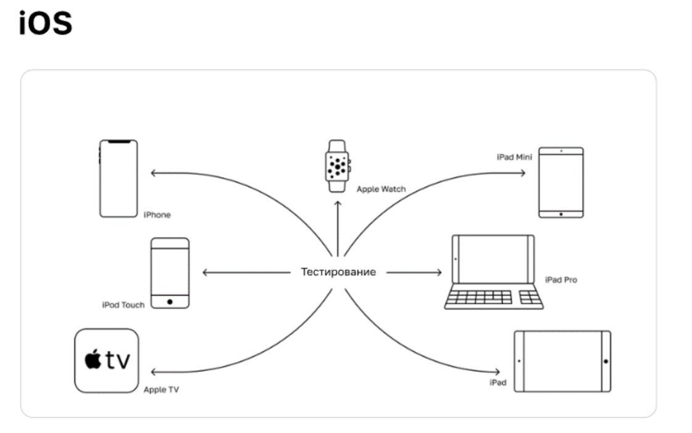
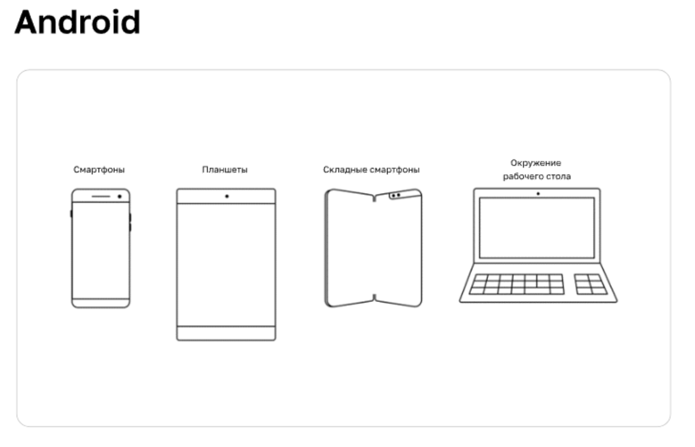
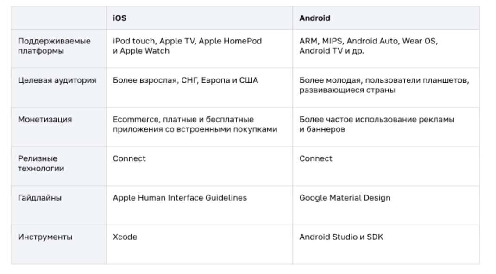

### Ручное тестирование мобильных приложений. Введение

### Отличия от десктопа и веба
* Разнообразие устройств: тысячи моделей телефонов и планшетов с различными размерами экранов, разрешениями и производительностью.
* Операционные системы: две ведущие платформы — Android и iOS — требуют раздельного подхода к разработке и тестированию.
* Ресурсозависимость: ограниченность ресурсов устройства (батарея, память, процессор), влияющая на производительность и стабильность.
* Мобильная связь: возможность потери сигнала, медленная скорость передачи данных, роуминг.
* Ограниченный контроль над средой: невозможно точно воссоздать среду эксплуатации (например, качество сети, заряд батареи).
* Частые обновления: мобильные приложения часто получают новые релизы и патчи, что требует постоянного тестирования изменений

### Особенности мобильного тестирования
* Конфигурационное и эксплуатационное тестирование. Необходимо проверить работоспособность приложения на множестве конфигураций устройств:
* Различные модели и марки смартфонов и планшетов.
* Разрешение экрана и плотность пикселей.
* Языковые локали и региональные настройки.
* Уровень заряда батареи и состояние памяти.

#### Релизный цикл. Процесс разработки мобильных приложений включает следующие этапы:
* Альфа-версии для внутреннего тестирования.
* Бета-релизы для ограниченной группы пользователей.
* Официальный релиз в магазинах приложений (App Store, Google Play).

#### Дополнительные подходы к тестированию:
* Эксплуатационный тест-драйв — проверка реальных условий использования (интернет, уровень заряда, фоновые процессы).
* UI-тестирование, включая доступность и удобство взаимодействия с приложением.
* Нагрузочное тестирование для оценки стабильности при большом количестве активных пользователей.
* Постоянная адаптация к изменениям

#### Стратегия, сложности, риски:
* Обязательная проверка приложения в Store перед публикацие на соответствие гайдлайнам
* Ограниченное количество времени на проведение тестов перед релизом.
* Высокая конкуренция на рынке и необходимость быстрого выхода обновлений.
* Необходимость поддерживать большое число устройств и операционных систем.
* Риск утечки конфиденциальных данных или нарушений безопасности.

### Операционные системы: iOS и Android

### Типы мобильных приложений

Мобильные операционные системы сочетают функциональность ОС для ПК с функциями мобильных и карманных устройств:
* сенсорный экран
* сотовая связь
* Bluetooth и Wi-Fi
* GPS-навигация
* камера и видеокамера
* распознавание речи
* диктофон
* музыкальный плеер
* NFC
* инфракрасное дистанционное управление

#### Нативные (iOS — Objective-C или Swif5 и Android — Java или Kotlin )
 * Много возможностей для разработк
 * Использование без сети

#### Веб-приложения ( HTML, JavaScrip5, React)
* Кросс-платформенность
* Ограниченный функционал

#### Гибридные 
* Совмещённое использованиетехнологий, описанных выше

### Различия iOS и Android

Гайдлайны (guidelines) — это набор рекомендацийот создателей платформы или операционной системы.
Благодаря им в приложениях сохраняется единообразие,даже если их создают разные разработчики.

**Гайдлайны мобильных приложений описывают**:
* принципы навигации и взаимодействия
* элементы интерфейса и их стиль
* используемую типографику и иконографию
* цветовые палитры и многое другое

