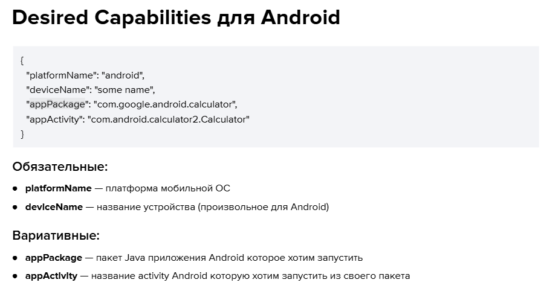
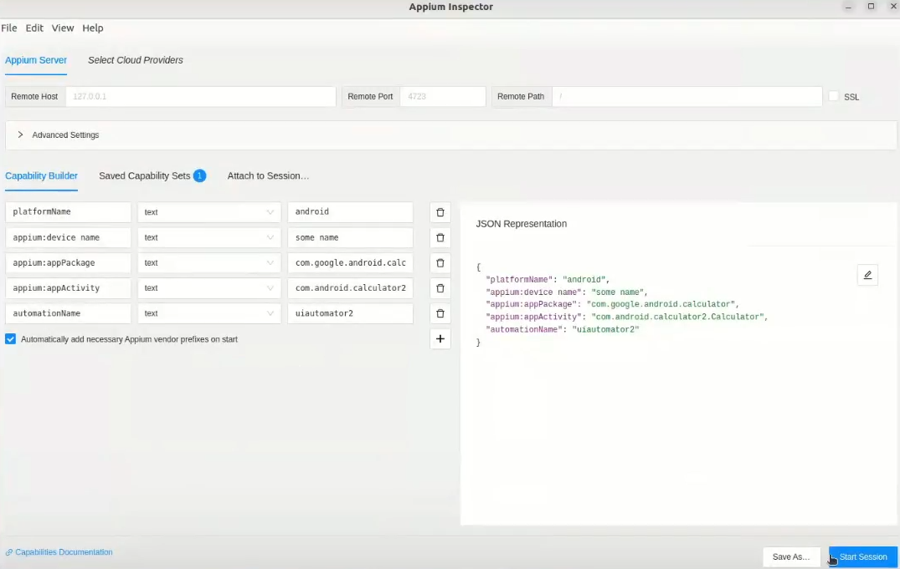
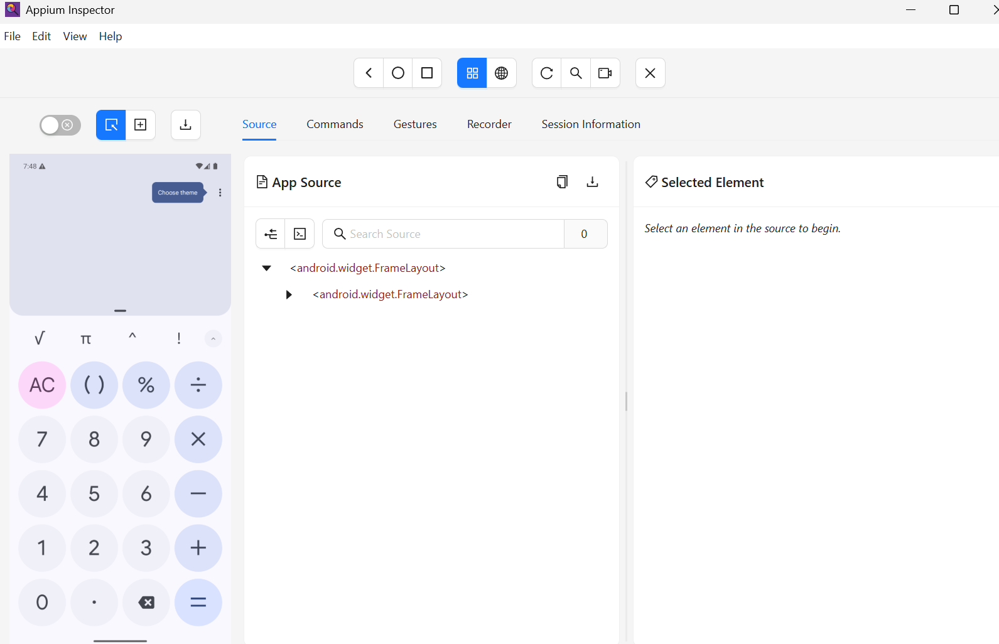

### Appium. Кроссплатформенная мобильная автоматизация тестирования

**Appium** — это инструмент с открытым исходным кодом для автоматизации тестирования нативных, веб и гибридных мобильных приложений (iOS, Android), а также десктопных приложений.

Appium является кроссплатформенным: он позволяет писать тесты для нескольких платформ (iOS, Android, Windows), используя один и тот же API. Это позволяет повторно использовать код между наборами тестов iOS, Android и Windows.

Философия Appium
* Не нужно перекомпилировать приложение или изменять его для автоматизации1
* Не должно быть привязки к определённому языку или фреймворку для написания и запуска тестов
* Фреймворк мобильной автоматизации не должен изобретать велосипед, когда дело касается API-автоматизации
* Фреймворк мобильной автоматизации должен быть open source

Установка: 

* ```npm install -g appium``` - установка фреймворка 
* ```appium driver install uiautomator2``` - установка драйвера для подключения к платформам Android
* ```appium driver install xcuitest```  -  установка драйвера для подключения к IOS платформам 
* ```npm install appium-doctor -g```  -  утилита проверяет, какие настройки подключены к appium ( запуск: ```appium-doctor```)
* ```npm install -g appium-inspector```  - так же возможно скачивание через  гитхаб. (запуск: ```nohup appium-inspector &``` )

Настройки инспектора

```
{
  "platformName": "android",
  "deviceName": "some name",
  "appPackage": "com.google.android.calculator",
  "appActivity": "com.android.calculator2.Calculator",
  "automationName": "uiautomator2"
}

{
  "platformName": "iOS",
  "deviceName": "iPhone 11",
  "bundleId": "com.shubham-iosdev.Calculator-UI",
  "automationName": "XCUITest"
}
```

Запуск сервера ```appium```




**Часто используемые методы UiSelector:**

* text(“значение”): соответствует точному тексту
* textContains(“partial”): соответствует, если текст содержит подстроку
* textMatches(“regex”): сопоставляет текст с использованием регулярного выражения
* resourceId(“id”): соответствует точному идентификатору ресурса
* resourceIdMatches(“regex”): сопоставляет идентификатор ресурса с использованием регулярного выражения
* description(«desc»): соответствует точному описанию содержимого
* descriptionContains(“desc”): соответствует, если описание содержимого содержит подстроку
* className(“android.widget.Button”): соответствует классу элемента
* checked(true/false): совпадения на основе отмеченного состояния
* enabled(true/false): совпадения на основе включенного состояния
* selected(true/false): совпадения на основе выбранного состояния
* index(int): соответствует элементу с определенным индексом в иерархии представлений (не только списки)


