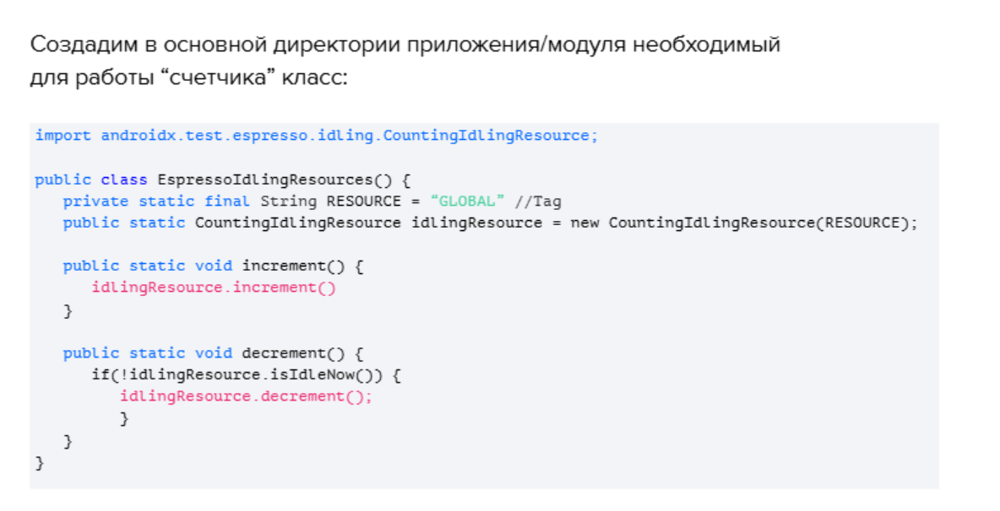
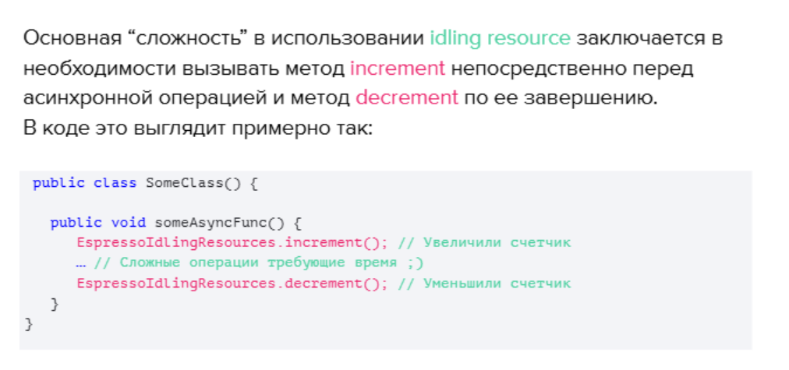
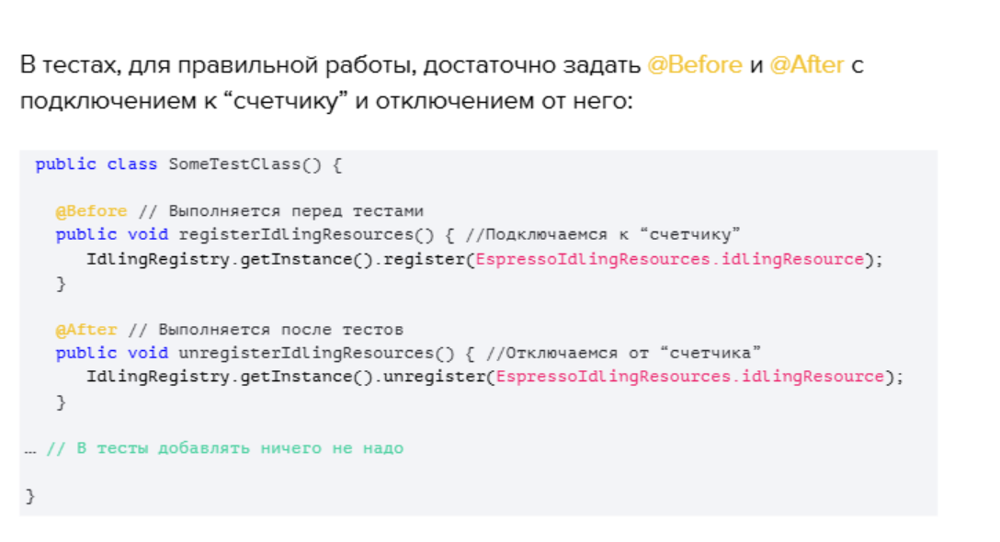
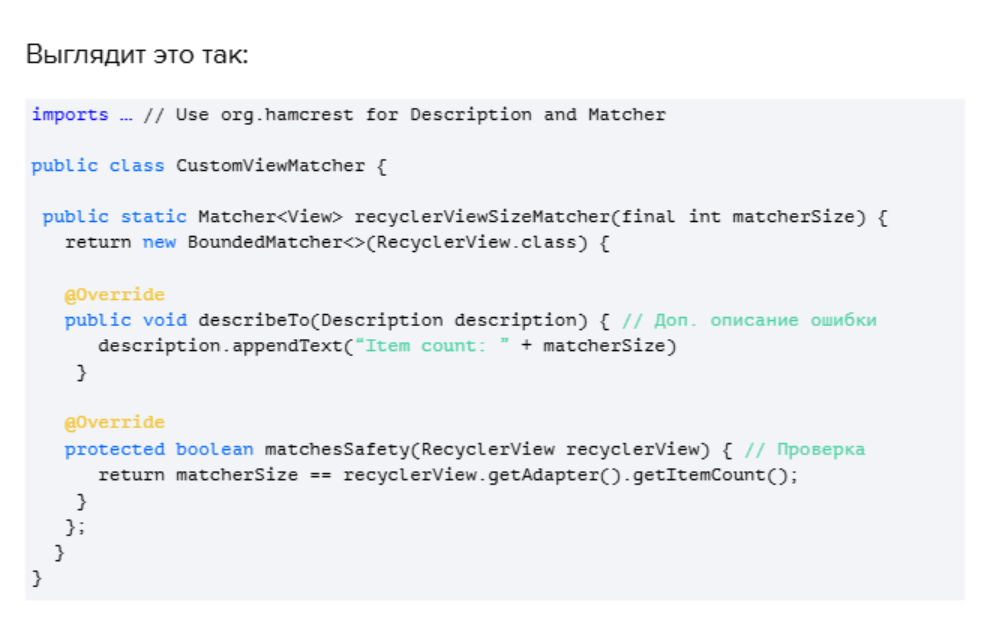
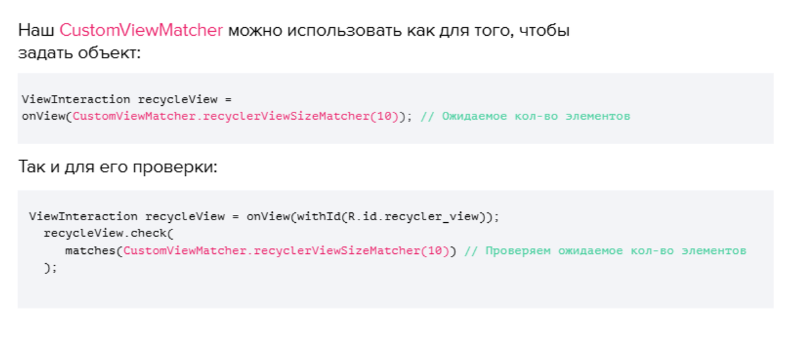
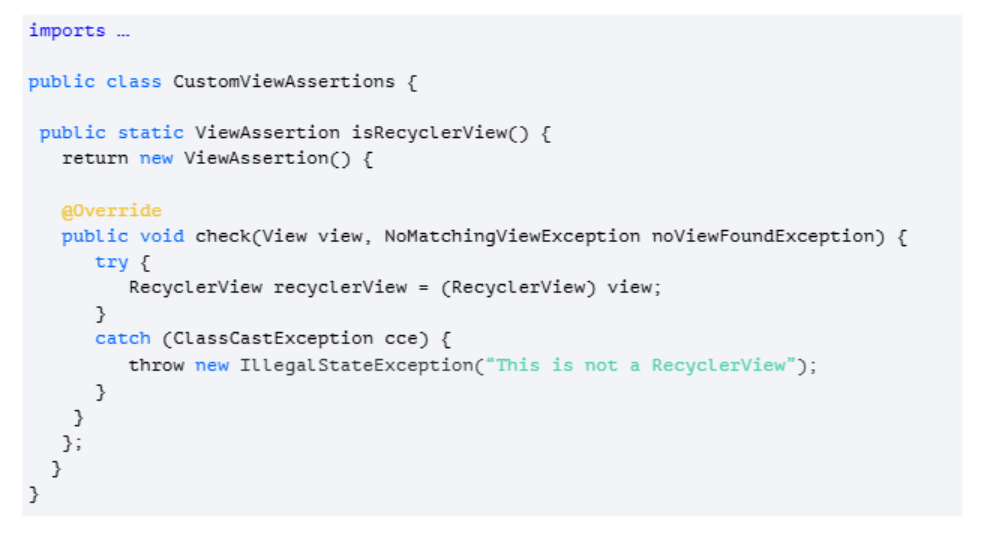

## Espresso. 

### Intent
Intent - это намерение, объект для запроса действий от другого компонента приложения


С его помощью можно:
1. Запускать Activity
2. Запускать Service
3. Передавать информацию между приложениями

Есть два типа Intent:
1. Explicit (Явные) - с указанием приложения, пакета или класса
2. Implicit (Неявные) - система выбирает приложение на основе
передаваемых данных

Перехват интентов в тестах используется для проверки данных. Подключение перехватчика возможно, как  перед всеми тестами, так и внутри отдельного теста.  Подключение перехвата перед тестами упрощает тесты, но при этом задействуется больше ресурсов и время тестов увеличивается.

#### Подключение проверки интентов

```
dependencies {
androidTestImplementation ‘androidx.test.espresso:espresso-intents:3.4.0’
}
```

1 вариант (перед всеми тестами)

```
// Меняем
@Rule
public ActivityTestRule<MainActivity> activityTestRule = new ActivityTestRule<>(MainActivity.class);
// На
@Rule
public IntentsTestRule intentsTestRule = new IntentsTestRule(MainActivity.class);

```

2 вариант (внутри тестов)

```
@Test
public void testName() {
...
Intents.init()
item.perform(click()); // Для срабатывания Intent
intended(hasData(“https://some.ru”)); // Проверка Intent
Intents.release(); // Для “очистки” записей Intents
}
```

### Работа с асинхронными операциями

Асинхронные операции в Android применяются для выполнения трудозатратных операций в фоновом потоке. Такие как общение с
сервером или загрузка картинок из хранилища. Обычно в случаях когда это занимает продолжительное время и информация не готова к
отображению пользователю, применяется “заглушка”.

Idling resources - позволяет дожидаться выполнения асинхронных операций в тестах. При этом выполнение теста будет продолжено после
выполнения операций, а не по истечению времени ожидания. По факту это реализация счетчика асинхронных операций и если он
равен 0, то тест может продолжить выполнять свои шаги.

```
dependencies {
implementation ‘androidx.test.espresso:espresso-idling-resources:3.4.0’
}

```

Этапы:







### ViewMatcher

ViewMatcher отвечает за атрибуты элемента. С его помощью проверяется состояние и задается уникальность элемента.

Рассмотрим простой пример:

У нас есть RecyclerView с неким списком и нам необходимо проверить количество элементов в списке. 
Для этого создадим новый класс CustomViewMatcher и метод возвращающий Matcher<View> внутри.


Разберем созданный класс подробнее:
* BoundedMatcher - абстрактный класс, содержащий в себе методы для простой реализации собственного Matcher.
* describeTo - метод позволяющий добавить дополнительное описание проверки элемента для лучшего восприятия ошибки, если проверка не прошла.
* matchesSafely - метод в котором проверяется соответствие атрибута элемента заданному значению.
В итоге, мы проверяем соответствие matcherSize - ожидаемое нами кол-во элементов и recyclerView.getAdapter().getItemCount(); - фактическое кол-во элементов



С помощью кастомного ViewMatcher мы смогли проверить количество элементов в RecyclerView. Но как проверить, что заданный элемент это
RecyclerView?
Для этого можно написать кастомный ViewAssertion. Создадим новый класс CustomViewAssertions и метод возвращающий ViewAssertion внутри.



Метод check(), который мы переопределяем, включает в себя заданный в тесте элемент View и Exception на случай если элемент не найден.
Для проверки элемента, мы пытаемся привести view к типу RecyclerView и кидаем исключения если не вышло.
Таким образом мы выполняем необходимую нам проверку и контролируем сообщение в случае ошибки.
В тесте наша проверка выглядит следующим образом:
```
@Test
public void someTest() {
   ViewInteraction recyclerView = onView(withId(R.id.recycler_view));
   recyclerView.check(CustomViewAssertions.isRecyclerView());
}
```