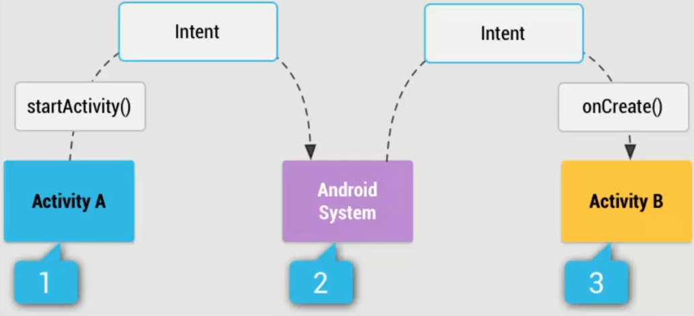

## Espresso. 

Intent - это намерение, объект для запроса действий от другого компонента приложения

С его помощью можно:
1. Запускать Activity
2. Запускать Service
3. Передавать информацию между приложениями

Есть два типа Intent:
1. Explicit (Явные) - с указанием приложения, пакета или класса
2. Implicit (Неявные) - система выбирает приложение на основе
передаваемых данных

Перехват интентов в тестах используется для проверки данных. Подключение перехватчика возможно, как  перед всеми тестами, так и внутри отдельного теста.  Подключение перехвата перед тестами упрощает тесты, но при этом задействуется больше ресурсов и время тестов увеличивается.