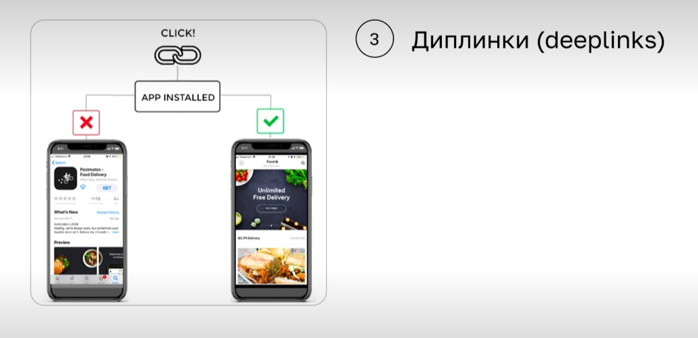
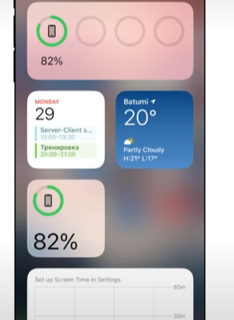
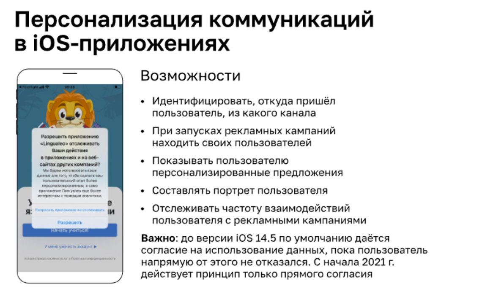
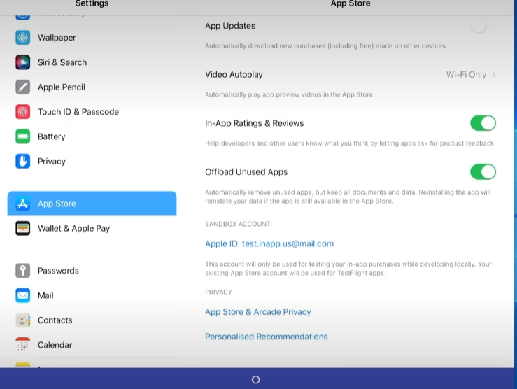

### Apple

Apple - это закрытая экосистема, компания сама производит устройства и разрабатывает ПО к ним.

Операционные системы Apple( являются полузакрытыми системами, у которых нет доступа к файловой системе приложения, и которые устанавливаются только через App Store):
* IOS
  * Мобильные телефоны
  * Планшеты(Ipad OS - аналог IOS для планшетов)
* watchOS
  * Часы Watch Apple
* macOS 
  * Компьютеры
* tvOS
  * Телефизоры

Начиная с iPhone 17, возможна установка приложений из других Store, но только на территории Евросоюза, так как это прописано в их законодательстве.

Как правило, каждый код компания выпускает новые девайсы и новое ПО для них. Чаще всего поддержка поддержка осуществляется только тех устройств, возраст которых не старше 4 лет. Информацию по поддерживаемым устройствам и версиям ПО можно найти на сайте производителя.

На конференциях Apple весной, как правило озвучивается информация о новых девайсах и новых ПО. После конференции становятся доступны бета-версии ПО.

У техники Apple есть две модели:
* Маркетинговая (iPhone 14, iPhone 15)
* Техническая  (iPhone 15.6 (для iPhone 14 ), iPhone 16.6 (iPhone 15))- во всех системах аналитики всегда указывается техническая модель.

Версии ПО
* Мажорная (IOS 15, IOS 16)
* Минорная (IOS 15.1, IOS 16.1)

Обновление операционной системы может происходить не на все девайсы, на те, которые перестанут поддерживаться, обновления не выходят.

### Гайдлайны

Гайдлайны позволяют ускорить дизайн и разработку ПО, в какой то мере она становится дешевой. За счет однотипных моделей интерфейс интуитивно понятен пользователю. Если вид не соответвует требованиям, то приложение может быть не выпушено в App Store.

#### Базовые принципы дизайна IOS:
   * Простота и воздушность интерфейса
   * Интерактивность (отзывчивость) и анимация изменения
     * Незаметная анимация, плавные переходы, быстрые изменения
     * Cкроллинг по законам физики
   * UI-киты для всех популярных инструментов (готовые иконки), шрифты
     * San Francisco — системный шрифт в iOS
     * Стиль кнопок и CTA-кнопки (call to action)
   * Единицы измерения в дизайне: pt (point)

     

#### Навигация и взаимодействие с пользователем
   * Внутренние экраны должны иметь собственную навигационную
   * Панель с кнопкой «Назад» в левом верхнем углу экрана приложения
   * Свайп вправо для перехода на предыдущий экран — альтернатива стрелке «Назад»
   * Основные элементы навигации должны быть на переднем плане.
   * Боковое меню используется для вторичной навигации

### Коммуникации с пользователями в iOS-приложениях

* Основные виды коммуникации
  * In-app-сообщения (сообщения внутри приложения)
    
  * Push-уведомления (всплывающие приложения в верхней части экрана, появляются, когда пользователь находится вне приложения, или на экране блокировки) Необходимо учитывать, что пользователь может согласиться получать уведомления или отказаться от их получения.  
    
  * Диплинки (deeplinks) (ссылки на ваше приложение.) Если приложение установлено, то после перехода по ссылке оно открывается, если нет, то открывается страница App Store и информацией о приложении и возможностью его скачать.
    
    
  * Виджеты - отдельные графические элементы на экране (к примеру витжет погоды) 

    

### Политика конфиденциальности Apple
Apple дает возможность пользователям отключать уведомления на постоянной основе или на выбранное время. В тестировании необходимо проверять все варианты, когда уведомления выключены. 

IDFA (The identifier for advertisers) — уникальный рекламный идентификатор, пользователь может запретить доступа к рекламе на устройстве.

## Сервисы распространения сборок и настройка тестовой среды

Сборкой iOS-приложения называют файл .ipa — архив, выпускаемый с соблюдением правил сертификации Apple через Xcode.

**Установка**
Официальные способы распространения: загрузка приложения через TestFlight  или App Store
Возможна так же прямая установка на девайс через iTunes(перестало поддерживаться)  или Apple Configurator
Магазины AltStore, AirPort, Departures доступны для скачивания приложений на территории Евросоюза для iPhone 17 и выше.

TestFlight - Сервис Apple, в котором можно легко приглашать пользователей протестировать приложения перед их релизом. Для скачивания приложения необходимо добавить, через разработчика, уникальный идентификатор устройства(UDID) в список разрешенных устройств, в так же получить пароль на email(привязанный к Apple ID) для скачивания.

UDID нужен разработчикам приложений для рассылки тестовых сборок. Его можно узнать с помощью:
1. MacOS и Xcode
2. Онлайн-сервисов: iFunbox, udid.tech, SuperUDID

Через TestFlight:
* Осуществляется отправка сборки в App Store
* Добавление внутренних и внешних тестировщиков
* Организация бета-тестирования
* Получение отзывов и отчётов о сбоях в работе приложения во время бета-тестирования
* Может использоваться, как альтернатива Store 

**Покупки**

1. Категории:
  * контент
  * сервис
  * функциональность
  * подписки
2. Типы:
  * расходуемые (consumables) - доступно к покупке только 1 раз
  * не расходуемые (non-consumables) - количество покупок может быть не ограничено
  * подписка с продлением (auto-renewable subscriptions) - тестируем, что оплаченый функционал будет доступен после автоматического продления
  * подписка без продления (non-renewing subscriptions) - тестируем, что после завершения подписки  не оплаченный функционал не будет доступен

**Создание sandbox-аккаунтов**

Sandbox Apple ID создаётся в App Store Connect. 

1. Чтобы тестировать покупки из приложения в среде Sandbox, убедитесь, что вы используете сборку приложения, подписанную для разработки
2. Войдите, используя Sandbox Apple ID: Настройки => App Store => Sandbox Account
3. Совершите покупку. Обратите внимание:текст [Environment: Sandbox] появляется при входе в систему и указывает на то, что вы подключились к тестовой среде
4. После тестирования не забудьте выйти из Sandbox Apple ID в настройках App Store

**Правила тестирования покупок**

* Не используйте email уже существующих Apple ID
* Аккаунты после создания нельзя редактировать
* Необходимо ввести данные карты оплаты
* Авторизация sandbox-аккаунта в продовой среде делает его более нерабочим
* Для теста Apple Pay важна страна магазина (не везде доступно)
* Встроенные покупки бесплатны только во время бета-тестирования
* Встроенные покупки, совершённые во время тестирования, не переносятся на версии приложений из App Store

Обязательна проверка стоимости покупки в прод и тестовой версии.

Работа тестовых покупок отличается от работы реальных. 

**Внутренние и внешние инструменты для тестирования iOS-приложений**

**Для чего Xсode нужен тестировщику:**

* XCTestCase
* Логирование и debug-режим
* Установка сборки на устройство
* UI, замедление анимации, слои в приложении
* Производительность, симуляция Out of memory
* Подмена геолокации
* Симулятор разных видов девайсов iOS есть только в Xcode
* Поддержка нескольких симуляторов, которые взаимодействуют друг с другом

Ограничения симулятора Xcode. 

* Аппаратные ограничения: камера, микрофонный вход, датчик
* Интерфейс может работать быстрее и плавнее, чем на устройстве
* Ограничения API
* Часть фреймворков не поддерживается: Media Player, StoreKit, Message UI
* Установка симуляторов и зависимость от версий Xcode
* Не существует настоящего симулятора iOS для Windows
* Симулятор разных видов девайсов iOS есть только в Xcode

Ни один симулятор не заменит тест на реальном устройстве.

**Возможности устройств:**

* Скриншоты, создание снимка всей страницы
* Запись экрана, начиная с iOS 13
* Передача файлов AirDrop
* Смена типа мобильной передачи данных

**Внешние инструменты для тестирования**
Логирование ошибок позволяет (mapping-файлы и dSYM-файлы для iOS)

* Формировать отчёты  об ошибках с описанием частоты появления их за выбранный период
* Экспортировать данные об ошибке
* Собрать статистическую информацию об устройствах, с которых были отправлены сообщения об ошибке
* Отслеживать повторного появления ошибки

**Дополнительные функции**

* Сбор продуктовой аналитики
* Построение аналитических отчётов
* Продуманная система коммуникаций с пользователем
* Настройка A/B-тестов
* Облачные лаборатории тестовых девайсов.

**Снифферы** (sniffers) — это программы, которые перехватывают и анализируют сетевой трафик. Они помогают извлечь из потока данных нужную информацию, например пароли, или провести диагностику сети.

### Этапы релизного цикла 

* Альфа- и бета-тестирование: демоверсии, бета-версии и пробные версии приложений не размещаются в App Store, используется только TestFlight
* Ревью приложения на соответствие требованиям Store (занимает от 1 дня)
* Релиз, возможность поэтапной раскатки (приложение становится доступно только части пользователей и помогает собрать информацию по результатам эксплуатации)
* Hotfix ( выкатка изменений после найденнных и исправленных багов)
* Доработки по запросам пользователей.

**Фичеринг приложений** - это подборка приложений из Store в качестве рекомендаций пользователям. Фичеринг помогает продвижению приложения.
На что смотрят Store:
* Качество и отсутствие ошибок
* Регулярные обновления. Поощряют разработчиков, которые используют последнюю версию Swift, интегрируют API Appleи поддерживают нововведения и тренды от Apple
* Страница приложения должна соответствовать действительному функционалу приложения
* Локализация приложения предполагает и локализацию страницы в магазине приложений
* Финансовые показатели: сторы чаще отдают предпочтение формату подписок, а не встроенных покупок
* Оценки и отзывы: рейтинг не ниже 4–4,5