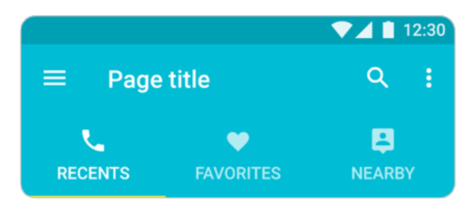
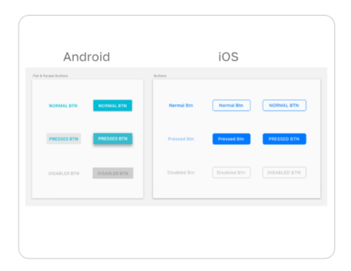
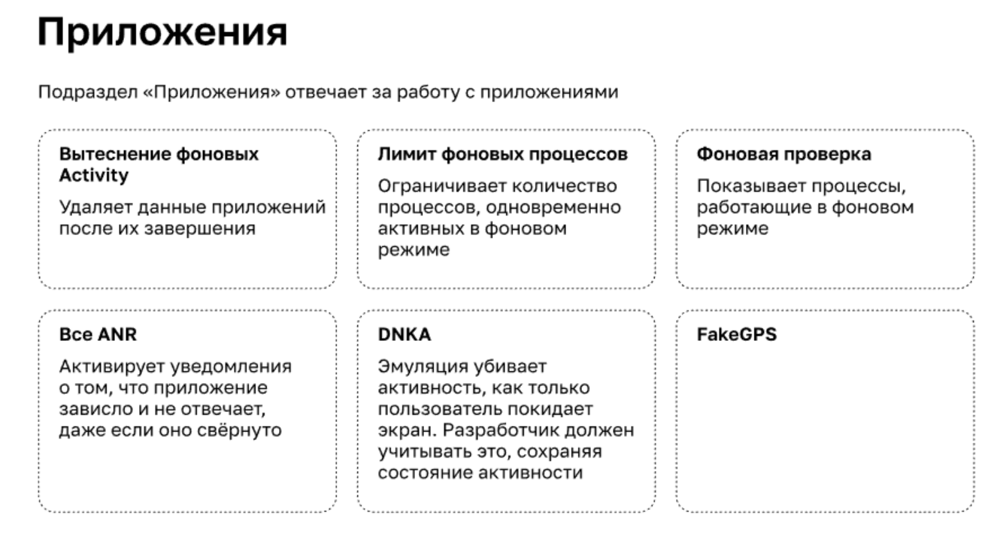
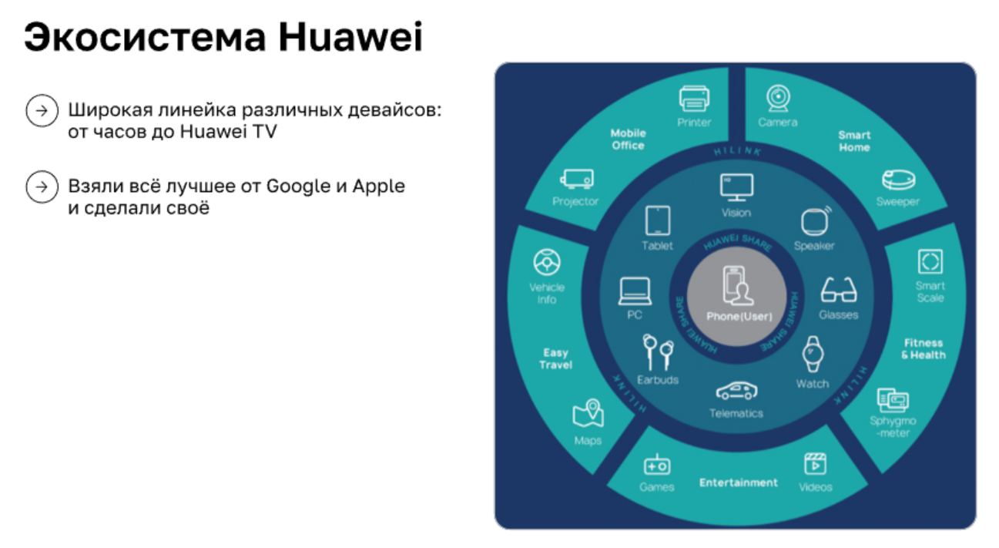
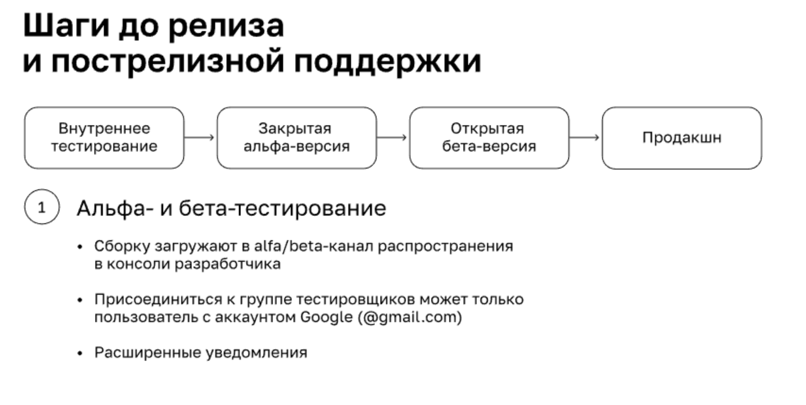

### Тестирование Android-приложений

#### Android и всё о нём.

Android — операционная система на базе Linux. Это открытая система. Есть доступ к файловой системе и есть возможность устанавливать приложения не только из Store.

**Android**
* Устройства от компании Nexus и Pixel (чистый андроид)
* One UI, MIUI, EMUI
* Wear OS, HarmonyOS, Firefox OS, MagicOS,
* Android TV, Android Auto

**Достоиоства**
* Регулярные системные обновления Android, в том числе частичные
* Обновления безопасности: функция прав для приложений, новые обновления безопасности и ПО для устройств с Android, безопасный просмотр сайтов
* Чистая ОС не требовательна к устройствам
* Возможность подстроить систему под себя
* Множество дополнений и приложений, расширяющих возможности ОС
* Длительная поддержка девайсов и приложений
* Бюджетные устройства
* Файловая система(есть доступ к ней)

**Недостатки открытой платформы**
* Постоянная борьба за снижение энергопотребления девайсов
* Проблемы безопасности. Вредоносное ПО
* Контент, который реализуется через Google Play, засорён
* Поддержка огромного количества версий сказывается на разработке
* Навигация и настройки

Новая версия ОС выходит раз в год, и только в мажорной версии.

**Особенности разработки Android-приложений**

*Преимущества*
* Ежегодные гайдлайны по разработке приложений
* Отличная документация от Google
* Огромное сообщество разработчиков
* Системная навигация на устройстве
* Среда разработки Android Studio
* Множество библиотек, плагинов, фреймворков ввиду открытости кода
* Проще начать разрабатывать.
* Языки разработки — Java, Kotlin
* Много пользователей. Активные отзывы в Storе

*Недостатки*
* «Зоопарк устройств» — нужно поддерживать приложение для разных моделей и экранов 
* Одновременно существует множество разных версий OS. Каждый производитель девайсов с Android кастомизирует систему
под свои девайсы
* Вечная борьба за снижение энергопотребления и безопасность
* Сниженные ожидания к качеству со стороны пользователей, в сравнении с iOS

#### Принципы навигации и взаимодействия с пользователем.

Гайдлайны мобильных приложений описывают:
* принципы навигации и взаимодействия
* элементы интерфейса и их стиль
* используемую типографику и иконографию
* цветовые палитры

Использование рекомендаций от Store позволяет:
* Уменьшить время на  дизайн и разработку, стандартизировать разработку.
* Интерфейс более понятен пользователю
* Увеличить вероятность на фичеринг (бестлатную рекламу) от Google Play

Неправильно подобранный DPI  может превести к тому, что часть кнопок будет находиться вне видимости экрана.

Начиная с Андроид 12 дизайн приложений становится более похожим на дизайн IOS

* Акцент на анимации, виджетах, скруглениях, уведомлениях, Jetpack Compose
* Многие элементы пользовательского интерфейса стали ярче и крупнее
* Новая панель управления с обширной информацией о каждом запрошенномразрешении
* Возможность выбрать внешний вид и поведение ОС

*Навигация*

* Универсальная панель навигации на устройстве
* Navigation Drawer (боковая панель)
* Табы вместо tabbar (iOS)
* AppBar (Android) вместо NavBar (iOS) — панель инструментов в верхней части экрана, которая содержит кнопки управления текущим экраном

* Навигационные переходы
  * Новые экраны появляются, растягиваясь из центра экрана
  * При выборе экрана из навигации экран плавно появляется без растяжения

* Специальный вид элементов управления по умолчанию:
   * чек-боксы, радиокнопки, тумблеры, календарь

* Два стиля кнопок: плоский и объёмный. Текст на кнопках в Material Design чаще всего в верхнем регистре
* Два типа нижних экранов:
  * Модальные нижние экраны
  * Постоянные нижние экраны
* Два типа шрифтов:  Roboto — стандартный шрифт в Android и Noto(для устройст, которые не поддерживают Roboto)

#### Коммуникация с пользователями.

*Персонализация коммуникаций в приложениях*

Рекламный идентификатор в андроид называется Google Advertising ID (AAID).

* Работает по примеру  IDFA — iOS-идентификатором
* В андроидах есть возможность обнулять уникальный идентификатор устройства в отличие от iOS
* Политика Google Play запрещает использовать идентификатор для программы с тематекой «Приложения для всей семьи»

Персонализация коммуникаций в приложениях позволяет:

* идентифицировать, из какого канала пользователь пришёл
* при запусках рекламных кампаний находить своих пользователей
* показывать пользователю персонализированные предложения, составляя портрет пользователя
* отслеживать частоту взаимодействий пользователя с рекламными кампаниями

Типы коммуникаций:

* IN-APP-сообщения
* PUSH-уведомления
* Диплинки
* Виджет
* Баннер
* Веб-фрейм
* Контекстное меню

#### Сервисы распространения сборок и настройка тестовой среды.

Существует два типа сборок Аndroid-приложений: APK и AAB.

APK - приложение устанавливается полностью со всеми кодами и ресурсами для него. 

AAB - набор АПК,  настроенных под определенный девайс (позволяет скачивать только нужную конфигурацию).   Впервые были представлены в GooglePlay в августе 2021 года.

Плюсы: 
* Универсализация сборок. Система Android поддерживает 4 архитектуры, 6 разрешений графики и более 150 языков

Минусы:
* Требует дополнительные разрешения на установку
* Сложно тестировать обновления девелопмент-сборок
Ограниченный срок доступности сборки — 30 дней
* Невозможно поделиться или передать файл AAB для тестирования (распространяется только через Store)
* Чувствительность к санкциям

**AppTester в деталях**
Для тестирования нужно:

* Добавить тестировщика в firebase консоли
* Пригласить и оповестить о сборках по email

Важно помнить:

* Чтобы установить приложение через AppTester, нужно разрешение на установку приложений за пределами Google Play
* Срок действия загруженной сборки — 30 дней
* Доступны десктопная версия и мобильное приложение AppTester
* Есть возможность настроить доступ для тестового скачивания в Google Play

**Sandbox-аккаунты и тестирование покупок в приложении**
Что нужно проверить:
* настроена ли тестовая среда
* добавлена ли учётная запись тестировщика в Google Play Console в аккаунте разработчика
* используют ли для теста реальные аккаунты, которые отмечены в девелоперском аккаунте как тестовые
* привязана ли к аккаунту банковская карта
* есть ли тестовый девайс, залогиненный в тестовый аккаунт Google Play

**Важные моменты для теста покупок**

* Тестовые покупки доступны на тестовых и опубликованных в сторе сборках — важное отличие от iOS
* Можно быстро вернуть средства через Google-аккаунт, если была необходима реальная покупка
* Важно учитывать обработку ошибок при покупках
* При покупке лицензированному тестировщику будет доступно два способа оплаты:
  * тестовая карта, всегда подтверждать
  * тестовая карта, всегда отклонять
* Перед тестированием нужно опубликовать подписку или контент для продажи через приложение

Для тестовых покупок используют обычные Google-аккаунты с привязанной банковской картой.

#### Внутренние и внешние инструменты для тестирования.

**Возможности Android Studio для тестирования**
* Логирование и debug-режим
* Установка сборки на устройство
* UI. Слои в приложении. Анимации
* Производительность
* Симуляция Out of Memory
* Подмена геолокации
* Уровень заряда батареи, входящие звонки и SMS
* Симуляция использования датчика отпечатков
* Android-эмулятор девайсов
* Эмулятор планшета, часов Wear OS и устройств Android TV
* Повороты экрана и различные датчики

**Настройки разработчика на девайсе:**

* Набор настроек, отвечающих за интерфейс
  * Показывать обновления поверхности
  * Показывает элементы интерфейса, которые обновляются с помощью мерцаний
  * Показывать границы элементов 
  * Отображает границы элементов интерфейса
* Отразить интерфейс RTL-языки при тестировании локализации
* Анимация окон и переходов. Длительность
* Скорость анимаций в приложении
* Эмуляция дополнительных экранов Поверх главного экрана (отображает дополнительный с продублированным интерфейсом)
* Минимальная ширина — min 320dpi
* Позволяет имитировать аномалию

**Системные возможности устройств для тестирования**
* Скриншоты
* Запись экрана Android встроенными средствами
* Передача файлов
  * Если возможность предусмотрена производителем: Huawei Share, Samsung Quick Share, Xiaomi Share ̈
  * С помощью NFC и Android Beam, но только между телефонами  ̈
  * Старый добрый USB-кабель
* Смена типа данных мобильной передачи
* Chrome DevTools (Дебаг WebView-страниц внутри приложения — подключение по USB chrome://inspect/#devices)

**Сервисы логирования и аналитики**
Возможности:

* отчёты об ошибках + число появления ошибки за выбранный период
* экспорт данных об ошибке
* логирование ошибок: mapping-файлы и отладочные символы на Android, dSYM-файлы для iOS
* статистическая информация об устройствах, с которых были отправлены сообщения о крэшах
* отслеживание повторного появления ошибок
* сбор продуктовой аналитики
* построение аналитических отчётов
* продуманная система коммуникаций с пользователем
* настройка A/B-тестов
* облачные лаборатории тестовых девайсов

**Внешние инструменты**

* Снифферы: Charles, Fiddler, Wireshark
* Запись экрана: Mobize AZ, Recorder, XRecorde
* Эмуляторы для Android: Genymotion BlueStacks 
* Подмена геолокации (GPS-спуфер):Mock Locations, Fake GPS от Hola, GPS Emulator от RosTeam

#### Android – это не только Google.

**Huawei** 

**Особенности разработки**
* AppGallery Connect — все инструменты разработчика и маркетинга в одном месте
* Huawei ID для авторизации и оплат
* Huawei не используют Google-сервисы
* На Huawei свои инструменты для распространения и сбора аналитики. Информацию о них нужно искать в официальной документации

#### Релизный цикл Android-приложений.

Ревью стора занимает от двух часов до 3 суток. Нужно учитывать это во время релизов

После релиза нужно следить за аналитикой и отзывами в саппорте и сторе. Это поможет быстро среагировать при появлении проблем.

Hot-fixes - быстрая правка 1-2 критичных багов и выкатка приложения в продакшен.