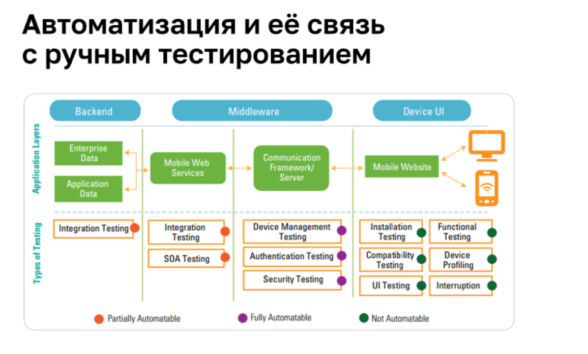

### Виды тестирования в контексте мобильных приложений

**Функциональное тестирование** - проверяет работу приложения на соответствие заяленным требованиям, на способность
ПО в определённых условиях решать задачи, нужные пользователям. 

**Нефункциональное тестирование** 
* GUI (соответствие приложения заявленным макетам, а так же гайдлайнам Store, корректность работы на разных экранах)
* UX (взаимодействие пользователя с приложением (жесты, нажатия))

**Тестирование установки**
* Установка из Store и не из Store
* Обновление
* Деинсталляция в разных форматах

**Энергопотребление**

**Тестирование при нехватке памяти ПО**

**Интеграционное тестирование (API)** - как при в заимодействии с сервером, так и со сторонними ресурсами(банковские операции, карты)

**Конфигурационное тестирование**
* серверное 
  * Аппаратные средства — тип и количество процессоров, объём памяти, характеристики сети и сетевых адаптеров и т. д. 
  * Программные средств — ОС, драйвера и библиотеки, стороннее ПО, влияющее на работу приложения и т. д.

* клиентское
  * Тип, версия операционной системы
  * Тип и версия веб-браузера, если тестируется
  * Веб-приложение или гибрид
  * Работа приложения при различных разрешениях экрана
  * Версии драйверов, библиотек и т. д.

**Тестирование совместимости с аппаратным обеспечением**

* Функций устройства + Soft & Hard Keys
* Разные экраны
* Температура устройства
* Датчики ввода данных
* Различные способы ввода данных
* Изменения ориентации экрана
* Типичные прерывания
* Права доступа к функциям устройства энергопотребления и состояния

**Тестирование доступности** (доступность для людей с ограниченными возможности).

**Тестирование совместимости с ПО устройством**
* Пользовательские настройки
* Ссылки быстрого доступа и диплинки
* Шаринг
* Кросс-платформенное взаимодействие
* Взаимодействие между приложениями

**Тестирование производительности**
* Нагрузочное тестирование
* Стресс-тестирование
* Тестирование большого объема данных
* Тестирование интернет соединения

**Тестирование локализации и глобилизации** - Учет региональных особенностей: языков, часовых поясов и т. д.

### Системный подход к качеству приложения

**Методики тестирования на основе опыта**

* Тест-персоны и мнемоники
* Эвристика
* Тест-туры
* Управление тестированием на основе сеансов
* Использование опыта коллег и конкурентов

**Системное тестирование программного обеспечения** — это тестирование программного обеспечения (ПО), которое выполняется на полной интегрированной системе, чтобы проверить соответствие системы исходным требованиям.

**Пострелизный контроль качества**
* Сбор информации по проблемам, которые не видят пользователи: скорость, креши, утечки памяти
* Сбором информации по проблемам от пользователей:
  * отзывы в Store, соцсетях, саппорте и прочих
  * формах сбора обратной связи
* Оценкой данных аналитики

**Что делать, если нет бюджета для полноценного тестирования**
* Использовать облачные сервисы
* Оптимизировать затраты на физические устройства
* Бета-тестирование
* Дополнительные источники для тестирования: аутсорс, коллеги
* Краудтестинг

### Процессы и частые ошибки

Чем прозрачнее и понятнее процессы коммуникации для команды, тем выше будет качество продукта.

Что может помочь:
* debug-меню
* качественные репорты
* связка сервисов
* командная работа
* проговорённые и согласованные регламенты

Девконсоли в приложении:
* помогают изменять состояние пользователя для сложных кейсов 
* позволяют искать конкретный продукт по техническим спецификам
* помогают считывать техническую информацию на экране

**Частые ошибки**
* Нет баланса между проверками: перекос в сторону GUI/UX
* Приложение тестируют так же, как веб
* Игнорируют проблемы, которые не видны пользователю (сбои)
* Игнорируют ЦА
* Нет продуманной и согласованной приоритизации
* Нет понимания задач бизнеса
* Игнорируют внешний опыт
