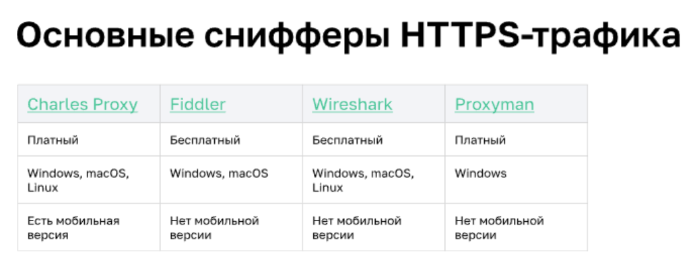

### Снифферы

Сниффер - тип программного обеспечения, которое анализирует весь входящий и исходящий трафик с компьютера, подключённого к интернету.

**Виды снифферов**
* Снифферы пакетов данных
* Снифферы Wi-Fi
* Снифферы сетевого трафика между клиентом и сервером
* Снифферы пакетов IP

**Мирные цели снифферов:**
* диагностика сети
* разведка и сбор данных при тестировании на проникновение
* выявление и устранение неполадок сети
* обнаружение вредоносного ПО
* мониторинг того, чем заняты пользователи и какие сайты они посещают
**Вредоносные цели:**
* перехват ценных данных: паролей, данных банковских карт и т. п.
* прослушка зашифрованного трафика
* запись сообщений, электронных писем, голосовых сообщений
* подделка данных

### Установка и настройка Charles Proxy

