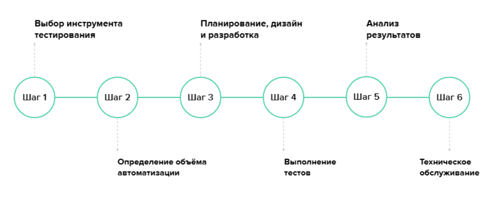
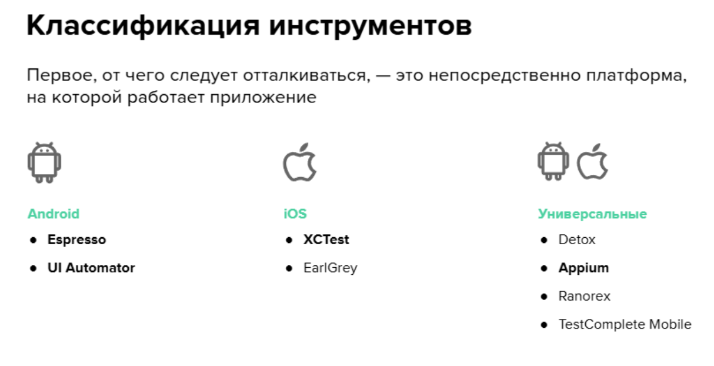

### Автоматизация тестирования мобильных приложений

Основная разница в тестировании  декстоп и мобильных приложений в том, что тесты при тестировании мобильного приложения запускаются на одном устройстве, а отрабатываются на другом.

**FIRST**

* Fast - скорость прохождения
* Independent - независимость тестов друг от друга(каждый начинается с чистого листа)
* Repeatable - одинаковый результат в не зависимости от устройства
* Self-validating - самопроверяемость или очевидность(тест должен возвращать понятный результат - либо да, либо нет)
* Timely - своевременноть - тесты должны тестировать последнюю версию кода.

#### Преимущества автоматизации тестирования мобильных приложений во многом совпадают с плюсами автоматизированного тестирования веб-приложений:

* быстрое получение результатов
* исключение человеческого фактора
* параллельное тестирование на множестве устройств
* возможность покрыть множество локалей
* концентрация внимания QA на новых функциях
* уверенность в работоспособности базовых функций (регрес тестирование)

#### Специфика мобильного тестирования

* Девайсозависимые дефекты - На разных телефонах приложение может повести себя по-разному из-за разных версий ОС, прошивки производителя, нестандартного разрешенияэкрана, версий Bluetooth и т. д.

* Связь функций приложения с железом - Некоторые приложения требуют взаимодействия с телефоном через Bluetooth — носимая электроника, фитнес-девайсы, NFC — сканирование, оплата, геолокацию — карты, а ещё через датчики, сенсоры и т. д.

* Вероятность быть прерванным - Необходимо тестировать приложение на прерывания: приходящие СМС, звонки подключение к зарядному устройству, низкий заряд аккумуляторов, смена ориентации экрана. А также на границах действия Bluetooth, в условиях слабого сигнала сети и т. п.

* Мобильное окружение - Мобильное тестирование может быть действительно «мобильным»: возможно, придётся бегать, прыгать с устройством или ходить с ним по городу и проверять работу приложения в полевых условиях

* Требования Google и Apple к релизу -  Перед выкладкой в Google Play и App Store приложение проходит проверку
на соответствие стандартам. Если будет выявлено несоответствие, выкладка будет отменена. Самостоятельная проверка на соответствие правилам может сэкономить время.

#### Процесс автоматизации тестирования

**Критерии выбора инструмента для мобильного тестирования:**
* платформа: Android или iOS
* необходимость кросс-платформенного тестирования
* необходимость интеграционного тестирования с другими приложениями
* компетенции команды
* наличие доступа к исходному коду приложения
* требования к языку сценариев
* требования к отчётам об испытаниях и их результатов

### Инструменты тестирования

**UI Automator** - Мощный нативный инструмент тестирования Android-приложений.
Особенности:
* UI Automator Viewer для отслеживания и анализа компонентов, отображаемых на экране в ходе теста
* API для получения информации о состоянии девайса и запуска процессов на нём
* Тестирование по принципу чёрного ящика: анализ производится с позиций внешнего пользователя без доступа к коду
* Может общаться с операционной системой и другими приложениями: активировать и деактивировать Wi-Fi, GPS, открывать меню настроек и т. д.

**Espresso** - Более лёгкий, по сравнению с UI Automator, инструмент нативного тестирования Android-приложений.

Особенности:
* Изолированное тестирование приложения
* Тестирование по принципу белого ящика: есть доступ к исходному коду
* Тестирование по принципу серого ящика: имеется доступ к некоторым внутренним процессам и структуре приложения
* Обладает мощным расширяемым API
* Можно записывать тест-кейсы с помощью рекордера

**XCTest** - Инструмент для нативного тестирования iOS-приложений:
* unit-тесты
* производительность
* пользовательский интерфейс

Особенности:
* Комплексное решение
* Используются языки программирования Objective-C/Swift
* Можно записывать тест-кейсы прямо с UI и автоматически создавать код на их основе

**Appium** - Популярный фреймворк автоматизации тестирования с открытым исходным кодом. Позволяет писать тесты под каждую из платформ с помощью единого API.

Особенности:
* Поддерживает большинство языков программирования
* Большое и активное комьюнити
* Работает с приложениями на Android и iOS
* Кросс-платформенное API
* Всё из коробки
* Работа с эмуляторами и реальными устройствами
* Под капотом использует UiAutomator и XCUITest

**Инструменты тестирования. Итоги**
* Если тесты будут писать разработчики, то лучше выбрать родной язык
и инструмент для их платформы
* Если тестами занимаются специалисты SDET, которые знакомы с другими языками
(Java, JavaScript, Python и др.) и работали с Selenium, удобно использовать
кросс-платформенный Appium
* Если опытного SDET в команде нет, а тесты будут писать специалисты QA,
лучше выбрать фреймворки для записи тестов и автогенерации кода

### Android Studio

Частые проблемы
* Убедитесь, что на жёстком диске С есть не менее 20 гигабайт свободного места под программу, проект и эмулятор
* При установке запрещено выбирать путь с кириллическими символами
* В момент установки соглашайтесь на установку всех дополнительных компонент и библиотек
* Для комфортной работы IDE и эмулятора требуется не менее 8 гигабайт оперативной памяти. Иначе рекомендуется использовать либо реальный девайс, либо эмулятор Genymotion
* Для работы эмулятора может потребоваться активация виртуализации
* Для подключения реального девайса могут потребоваться драйвера для USB

В Android выделяют несколько типов тестов, различающихся по способу использования и методу запуска:
* локальные unit-тесты
* инструментальные тесты

**Unit-тестирование** — процесс в программировании, позволяющий проверить на корректность отдельные модули исходного кода программы.

* Хранятся в Android-проекте по пути src/test/kotlin/
* Запускаются на локальной JVM (Java Virtual Machine)
* Требуют минимальное время на выполнение
* Не требуют вызова операционной системы Android
* Можно использовать заглушки (mock)
* Зависимости указываются через *testImplementation* в build.gradle

**Инструментальные тесты** — это тесты, позволяющие использовать классы и методы системы Android для проверки своих модулей.

* Хранятся в Android-проекте по пути src/androidTest/kotlin/
* Запускаются на физическом устройстве или на эмуляторе Android
* Используются для автоматической проверки действий пользователя
* Используют обращения к Android
* Компилируются в отдельный APK-файл
* Зависимости указываются через  *androidTestImplementation* в build.gradle