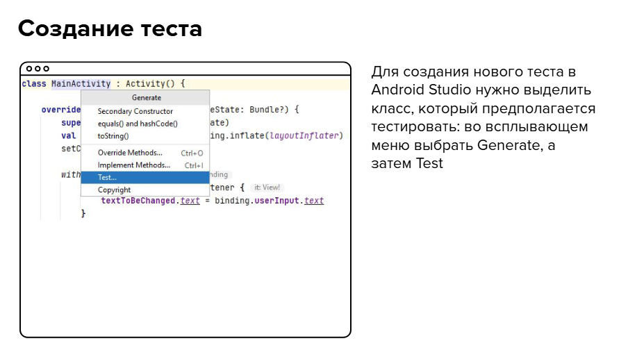
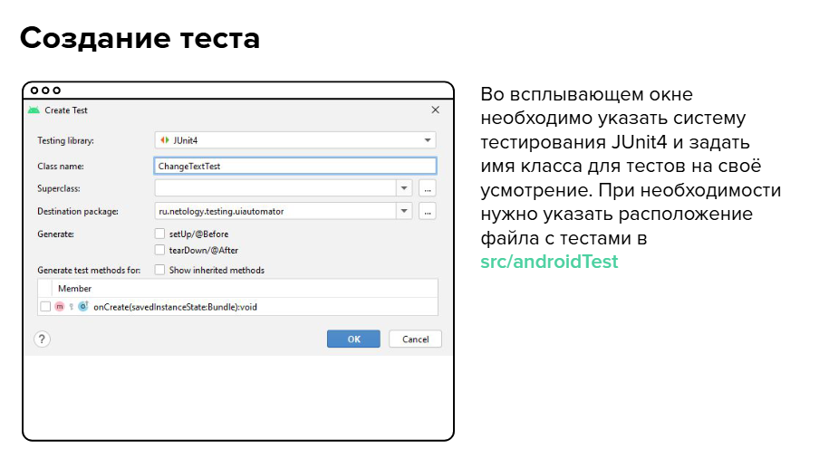
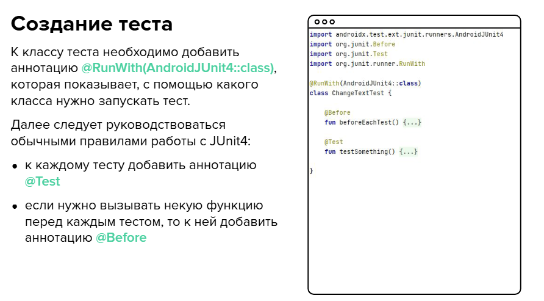
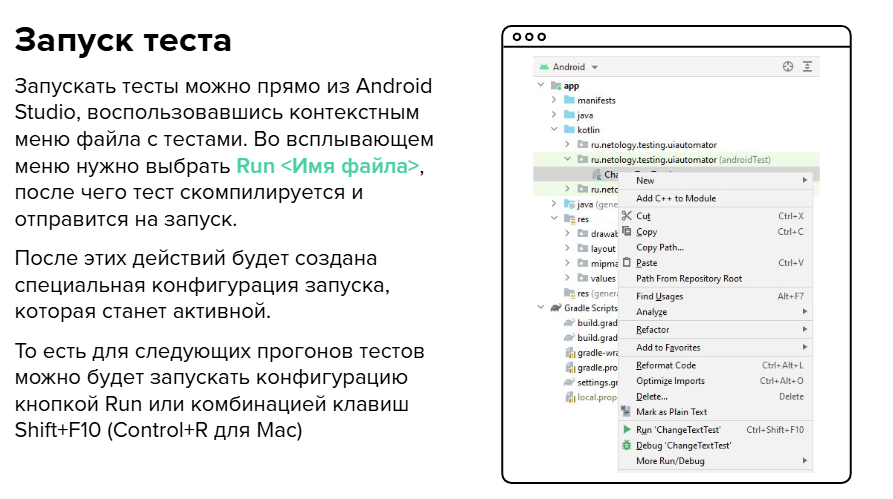

### UI Automator. Автоматизация тестирования Android

В Android выделяют несколько типов тестов, различающихся по способу
использования и методу запуска:
* Локальные unit-тесты
  * хранятся по пути ```src/test/```
  * запускаются на локальной JVM (Java Virtual Machine)
  * зависимости для таких тестов указываются через ```testImplementation```
* Инструментальные тесты
  * хранятся по пути ```src/androidTest```
  * запускаются на физическом устройстве или на эмуляторе Android
  * компилируются в отдельный APK-файл (отличный от APK-приложения) и имеют свой AndroidManifest.xml, расположенный в src/androidTest
  * зависимости для таких тестов указываются через ```androidTestImplementation```


Библиотека UI Automator предоставляет богатое API для взаимодействия с пользовательскими и системными приложениями.

Основные составляющие библиотеки:
* средство просмотра иерархии разметки UI Automator Viewer
* API для доступа и выполнения операций на устройстве
* API для работы с UI приложений

UI Automator Viewer предоставляет удобный способ для анализа разметки и просмотра свойств у её элементов. Перед запуском программы нужно сначала запустить анализируемое приложение на устройстве или эмуляторе.

Программа находится в Android SDK в папке ```<android-sdk>/tools/bin```. Из этой папки её же можно и запустить: ```$ uiautomatorviewer```
Затем необходимо нажать кнопку «Device Screenshot»: в программе отобразится структура разметки открытого приложения

**Подключение UI Automator**
Для подключения UI Automator к Android-проекту первым делом необходимо добавить зависимости в build.gradle

* core-ktx — базовая библиотека для Android-тестирования, содержит полезные функции-расширения для Kotlin
* junit-ktx — адаптация JUnit для Android и Kotlin
* runner — отдельная зависимость для запуска приложений на тестирование
* hamcrest — опциональная библиотека с готовыми функциями для поиска исравнения данных
* uiautomator — основная библиотека UI Automator

Помимо зависимостей, в build.gradle нужно ещё задать параметр ```testInstrumentationRunner```.

```
defaultConfig {
   applicationId "ru.netology.testing.uiautomator"
   minSdkVersion 21
   targetSdkVersion 31
   versionCode 1
   versionName "1.0"
   testInstrumentationRunner "androidx.test.runner.AndroidJUnitRunner"
} 
```
**Создание теста**










#### Инструменты для тестирования

Объект ```UiDevice``` — это основной способ доступа к состоянию устройства. В тестах можно вызывать методы UiDevice для проверки различных свойств: ориентации
устройства, размера экрана. Рекомендуется начинать тест с главного экрана устройства, а после этого уже вызывать необходимые методы из UI Automator API для взаимодействия с
визуальными элементами.

Метод ```pressHome``, который эмулирует нажатие кнопки «Домой», вызывающей переход на главный экран системы

Метод ```getLauncherPackageName``` возвращает имя пакета стандартного загрузчика приложений.
Обратите внимание, он формирует ```Intent``` с ```ACTION_MAIN``` и ```CATEGORY_HOME```, после чего запрашивает у системы приложение по умолчанию, способное обработать запрос

Метод ```wait``` ждёт, пока переданное ему условие не станет истиной.

Самый главный метод для этого — ```findObject```. 
Он выполняет поиск элемента, удовлетворяющего заданному условию. Когда элемент найден, над ним можно выполнять операции: нажатие, изменение текста, различные жесты и т. п. Также есть интересные дополнительные методы:
* ```click``` — нажатие в произвольное место экрана по координатам
* ```swipe``` — жест смахивания (свайп) в заданном месте
* ```openNotification``` — открытие системной шторки уведомлений
* ```openQuickSettings``` — открытие панели быстрых действий (над уведомлениями)
* ```takeScreenshot``` — сохранение скриншота экрана в отдельный файл на устройстве

```Until``` — это класс с фабричными функциями для построения поисковых выражений ```SearchCondition```. Самые часто используемые функции:

* ```hasObject``` возвращает выражение, которому достаточно хотя бы одного элемента на экране, удовлетворяющего условию
* ```findObject``` возвращает выражение с самим элементом, удовлетворяющим условию
* ```textEquals``` возвращает выражение, требующее элемент, текст которого в точности совпадает с требуемым
* ```textMatches``` — функция, аналогичная textEquals, но она принимает регулярное выражение

Отдельно отметим, что класс формирует выражения, а не выполняет реальный поиск  объектов. 

Для поиска объектов нужно использовать ```UiDevice.findObject```

```By``` — это класс с фабричными функциями для построения объектов класса ```BySelector``` (выборок
из элементов). Выборки передаются в UiDevice.findObject для выполнения поиска элемента.
Самые часто используемые критерии:
* ```pkg``` устанавливает ограничение на пакет приложения
* ```res``` устанавливает ограничение на имя ресурса
* ```text``` устанавливает ограничение на текст элемента
* ```enabled``` устанавливает ограничение на свойство enabled у элемента
* ```depth``` устанавливает ограничение на глубину поиска
* ```hasChild``` задаёт выборку для дочерних элементов
* ``hasDescendant`` задаёт выборку для элементов-потомков любой степени родства

```UiSelector``` — ещё один класс для выборки UI-элементов. Во многом его методы повторяют методы класса ```By```. Различие состоит в том, что ```By``` возвращает выборку из текущих элементов, а ```UiSelector``` описывает цепочку ограничений, которая применяется каждый раз, когда идёт обращение к выборке.

